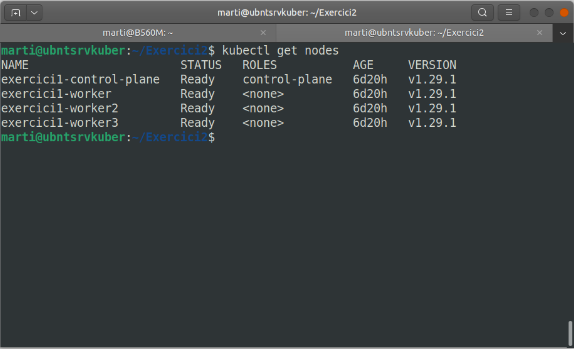
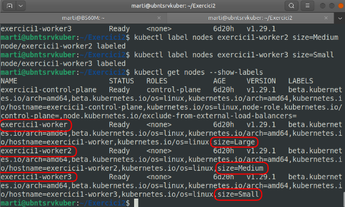
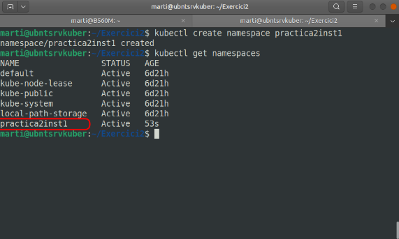

# Configuració de Kubernetes

## Introducció

Revisam la instal·lació que tenim feta de l’exercici anterior. Miram primer quins nodes tenim:



Com podem veure, ens ha creat els 3 workers i el control plane. Anem a començar, sabent d’on partim, amb la pràctica 2.

### Etiquetar els nodes

Els nodes han de tenir les següents labels:	

- worker1: size=Large
- worker2: size=Medium
- worker3: size=Small

Emprarem la comanda del tipus:

```bash
kubectl label nodes <node> <key>=<map>
```
La posam en marxa en el nostre exercici:

```bash
kubectl label nodes exercici1-worker size=Large
kubectl label nodes exercici1-worker2 size=Medium
kubectl label nodes exercici1-worker3 size=Small
```

Revisam que tinguin les etiquetes correctes amb la comanda:

```bash
kubectl get nodes --show-labels
```



## Instalación 1 

>Desplegar un pod con varias labels que tiene 2 contenedores (web y cache).
>Adicionalmente , tiene como requisitos un mínimo de 100 megabytes de RAM. Debe desplegar únicamente en el worker3. Debe tener configurada una estrategia de control para que se reinicie en caso de problemas. Debe hacerse en un namespace con nombre practica2inst1.

Cream primerament el namespace per tenir-lo creat per endavant, amb la comanda:

```bash
kubectl create namespace practica2inst1
```

Amb la comanda següent revisam els namespaces creats:

```bash
kubectl get namespaces
```



Un cop tenim el namespace creat, crearem la definició del nostre pod al yaml:

```yaml
apiVersion: v1
kind: Pod
metadata:
  name: practica2inst1
  namespace: practica2inst1
spec:
  containers:
  - name: nginx-server
    image: nginx
    ports:
      - containerPort: 80
    resources:
      requests:
        memory: "100Mi"
  - name: cache
    image: redis
    resources:
      requests:
        memory: "100Mi"
  nodeSelector:
    size: Small
```


**Nota:** No hem sabut com fer el reinici en cas de problemes. Es fa mitjançant un liveprobe.

Aplicam el yaml amb la comanda:

```bash
kubectl apply -f pod2.yml
```
Llistam els pods que corren al node worker3 amb la comanda:

```bash
kubectl get pods --field-selector spec.nodeName=exercici1-worker3 --namespace practica2inst1
```

**Nota:** No és aquesta la comanda a emprar. Revisar!


