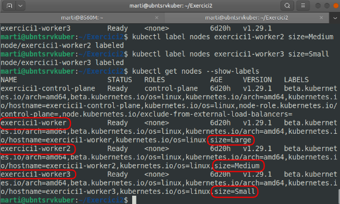

# Exercici 2 - Resolt

## Introducció

Revisam la instal·lació que tenim feta de l’exercici anterior. Miram primer quins nodes tenim:


Com podem veure, ens ha creat els 3 workers i el control plane. Anem a començar, sabent d’on partim, amb la pràctica 2.

### Etiquetar els nodes

Els nodes han de tenir les següents labels:	

- worker1: size=Large
- worker2: size=Medium
- worker3: size=Small

Emprarem la comanda del tipus:

```bash
kubectl label nodes <node> <key>=<map>
```
La posam en marxa en el nostre exercici:

```bash
kubectl label nodes exercici1-worker size=Large
kubectl label nodes exercici1-worker2 size=Medium
kubectl label nodes exercici1-worker3 size=Small
```

Revisam que tinguin les etiquetes correctes amb la comanda:

```bash
kubectl get nodes --show-labels
```



## Instalación 1 

>Desplegar un pod con varias labels que tiene 2 contenedores (web y cache).
>Adicionalmente , tiene como requisitos un mínimo de 100 megabytes de RAM. Debe desplegar únicamente en el worker3. Debe tener configurada una estrategia de control para que se reinicie en caso de problemas. Debe hacerse en un namespace con nombre practica2inst1.

Cream primerament el namespace per tenir-lo creat per endavant, amb la comanda:

```bash
kubectl create namespace practica2inst1
```

Amb la comanda següent revisam els namespaces creats:

```bash
kubectl get namespaces
```


Un cop tenim el namespace creat, crearem la definició del nostre pod al yaml:

```yaml
apiVersion: v1
kind: Pod
metadata:
  name: practica2inst1
  namespace: practica2inst1
spec:
  containers:
  - name: nginx-server
    image: nginx
    ports:
      - containerPort: 80
    resources:
      requests:
        memory: "100Mi"
  - name: cache
    image: redis
    resources:
      requests:
        memory: "100Mi"
  nodeSelector:
    size: Small
```


**Nota:** No hem sabut com fer el reinici en cas de problemes. Es fa mitjançant un liveprobe.

Aplicam el yaml amb la comanda:

```bash
kubectl apply -f pod2.yml
```
Llistam els pods que corren al node worker3 amb la comanda:

```bash
kubectl get pods --field-selector spec.nodeName=exercici1-worker3 --namespace practica2inst1
```

**Nota:** No és aquesta la comanda a emprar. Revisar!

## Instalación 2

>Despliegue de una aplicación web con 2 réplicas del mismo servidor web. Debe hacerse en un namespace con nombre practica2inst2.
(contenido clase 3) Adicionalmente, deben desplegarse en los nodos de tamaño Medium o Large y deben tener unos healthchecks que controlen el correcto funcionamiento. Los pods no pueden ejecutarse en el mismo nodo. Una vez esté funcionando añadir una réplica más y mostrar el estado del despliegue.


Anem primerament a crear el nou namespace per aquesta segona pràctica amb la comanda:

```bash:
kubectl create namespace practica2inst2
```

Un cop tenim el namespace creat, anem a crear la definició de la réplica al fitxer yaml:

```yaml:
apiVersion: apps/v1
kind: ReplicaSet
metadata:
  name: practica2inst2
  namespace: practica2inst2
spec:
  replicas: 2
  selector:
    matchLabels:
      app: webserver
  template:
    metadata:
      labels:
        app: webserver
    spec:
      containers:
      - name: nginx-server
        image: nginx
```

Empram la comanda per posar en marxa les rèpliques:

```bash:
kubectl apply -f replica.yml --namespace=practica2inst2
```

Veim que ens crea la rèplica:


I tenim els pods creats:


Empram la comanda següent per veure a quin node està cada pod:

```bash:
kubectl describe pod practica2inst2-99jcb -n=practica2inst2
```


Podem veure que el primer s’ha creat al node worker i el segón, ho ha fet al node worker2. Com no hem indicat a quins nodes s’havien d’allotjar, ho han fet al que l’scheduler ha cregut més convenient.

Anem a canviar el nostre yml, per tal de fer un deployment dels nostres pods amb les condicions que se’ns demana:
Que tinguin Healthcheck que controli el funcionament correcte dels pods
S’han de desplegar als nodes Medium o Large
No es poden executar al mateix node

Per mirar de que tenguin un Healthcheck emprarem un LiveProbe  afegint el següent:

 ```yaml: 
  spec:
      containers:
      - name: nginx-server
        image: nginx
        ports:
          - containerPort: 80
        livenessProbe:
          httpGet:
            path: /
            port: 80
          initialDelaySeconds: 10
          periodSeconds: 5
```

Per mirar que només s’executin als nodes Large i Medium afegirem el següent codi:

```yaml:
      affinity:
        nodeAffinity:
          requiredDuringSchedulingIgnoredDuringExecution:
            nodeSelectorTerms:
              - matchExpressions:
                - key: size
                  operator: In
                  values:
                  - Large
                  - Medium
```

Finalment, per fer que no s’executin al mateix node, emprarem la característica AntiAffinity:

```yaml:
        podAntiAffinity:
          requiredDuringSchedulingIgnoredDuringExecution:
          - labelSelector:
              matchExpressions:
              - key: app
                operator: In
                values:
                - webserver
            topologyKey: "kubernetes.io/hostname"
```


El fitxer resultant és el següent:

```yaml:
apiVersion: apps/v1
kind: ReplicaSet
metadata:
  name: practica2inst2
  namespace: practica2inst2
spec:
  replicas: 2
  selector:
    matchLabels:
      app: webserver
  template:
    metadata:
      labels:
        app: webserver
    spec:
      containers:
      - name: nginx-server
        image: nginx
        ports:
          - containerPort: 80
        livenessProbe:
          httpGet:
            path: /
            port: 80
          initialDelaySeconds: 10
          periodSeconds: 5
      affinity:
        nodeAffinity:
          requiredDuringSchedulingIgnoredDuringExecution:
            nodeSelectorTerms:
              - matchExpressions:
                - key: size
                  operator: In
                  values:
                  - Large
                  - Medium
        podAntiAffinity:
          requiredDuringSchedulingIgnoredDuringExecution:
          - labelSelector:
              matchExpressions:
              - key: app
                operator: In
                values:
                - webserver
            topologyKey: "kubernetes.io/hostname"
```

Executam la comanda següent per actualitzar la rèplica:

```bash:
kubectl apply -f replica2.yml --namespace=practica2inst2
```
I confirmam que els pods estan correctes, amb la comanda:

```bash:
kubectl get pods -n=practica2inst2
```


Veurem ara si s’ha canviat la distribució de cada pod en funció de l’afinitat amb la comanda:

```bash:
kubectl describe pod practica2inst2-99jcb -n=practica2inst2
```


Recordam que havíem assignat les etiquetes als nodes i podem veure que han anat als nodes que toca: Large o Medium. No han canviat de node perquè ja havien caigut a nodes compatibles o afins.


c) Miram d’augmentar en un la rèplica però ja podem preveure el resultat. Si no permetem que hi hagi més d’un pod a un node, i només hi ha 2 nodes possibles, llavors és segur que aquest pod no es pugui ubicar i quedi pendent fins que es creï un node que sí ho permeti.


