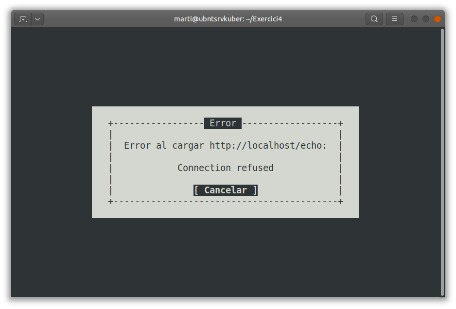

# Exercici 4 - Resolució

1. En aquest exerci el que volem fer és crear una web que retorni un echo  de la sol·licitud enviada pel client. Per això existeix la imatge [ealen/echo-server:latest](https://github.com/Ealenn/Echo-Server) que cumpleix amb això (*An echo server is a server that replicates the request sent by the client and sends it back.*).

Per dur-ho a terme el que farem serà:
- Crear un namespace a posta per aquesta pràctica
- Crear un deployment amb 2 rèpliques d'aquesta imatge
- Crear un service que ens gestioni internament com es reparteix el servei als pods creats pel deployment
- Crear un ingress que ens traspassi la sol·licitud externa i l'atorgi al nostre servei
- Crear un Ingress Controler que gestioni el nostre Ingress.


Font: https://kubernetes.io/docs/concepts/services-networking/ingress/

## Namespace

Aquesta part és la més senzilla de totes. Així i tot, també la feim declarativa:

```yaml:
apiVersion: v1
kind: Namespace
metadata:
  labels:
    kubernetes.io/metadata.name: ns-practica4
  name: ns-practica4
```
>Nota: En aquest cas s'ha fet emprant una label compartida. No entenc ben bé perquè ha de ser així, ja que no crec que hi hagi necessitat de compartir el namespace. 

## Deployment
El fitxer de definicions del deployment serà:

```yaml:
apiVersion: apps/v1
kind: Deployment
metadata:
  name: echoserver
  namespace: ns-practica4
spec:
  replicas: 2
  selector:
    matchLabels:
      app: echoserver
  strategy:
    rollingUpdate:
      maxSurge: 25%
      maxUnavailable: 25%
    type: RollingUpdate
  template:
    metadata:
      labels:
        app: echoserver
    spec:
      containers:
      - image: ealen/echo-server:latest
        imagePullPolicy: Always
        name: echoserver
        ports:
        - containerPort: 80
          protocol: TCP
```

L'executam mitjançant:

```bash:
kubectl apply -f deployment.yaml
```
Veim que s'han creat:

```bash:
kubectl get pods -n=ns-practica4
NAME                          READY   STATUS    RESTARTS   AGE
echoserver-65c4b4448b-dxmdt   1/1     Running   0          60m
echoserver-65c4b4448b-grbn2   1/1     Running   0          60m
```

Això ens crea 2 Pods de la imatge de echo-server.

>Nota: No està explicat (crec) el rollingUpdate i els seus atributs

## Service

El fitxer del service que gestiona com un balancejador de càrrega entre els diferents pods serà:

```bash:
apiVersion: v1
kind: Service
metadata:
  name: echoserver
  namespace: ns-practica4
spec:
  ports:
  - port: 80
    protocol: TCP
    targetPort: 80
  selector:
    app: echoserver
  type: ClusterIP
```

Punts importants:
- El port 80 és el port pel qual escolta el pod. El targetPort és el port pel que estcolta l'app.
- El definim com un ClusterIP (**no sé perquè. Investigar**)

## Ingress Controller

Aquesta és la part més fosca de l'exercici. Pareix esser que per a comunicar l'exterior amb l'interior de Kubernetes, és necessari fer servir un mòdul anomenat Ingress. Però hi ha un gestor d'Ingress, que és l'Ingress Controller. És com realment un gestor entre diversos connectors amb l'exterior.

A la documentació de Kubernetes trobam el mateix que al curs, que hi ha varis Ingress Controllers i inculús, per un mateix Ingress Controller hi ha divereses formes d'instal·lar-lo. Al final, no deixa de ser una definició més que genera tots els mòduls necessaris per fer aquesta funció (serveis, configmaps, namespaces,...)

El que ens recomanen al curs que instal·lem és el d'nginx, que és un load balancer o proxy invers.

Si anam a la [documentació d'Ingress de Kubernetes](https://kubernetes.io/docs/concepts/services-networking/ingress/), trobam que el Ingress Controller és un prerequisit per a què a quest primer pugui funcionar:

>**Prerequisites**   
You must have an [Ingress controller](https://kubernetes.io/docs/concepts/services-networking/ingress-controllers) to satisfy an Ingress. Only creating an Ingress resource has no effect.  
You may need to deploy an Ingress controller such as [ingress-nginx](https://kubernetes.github.io/ingress-nginx/deploy/). You can choose from a number of [Ingress controllers](https://kubernetes.io/docs/concepts/services-networking/ingress-controllers).  
Ideally, all Ingress controllers should fit the reference specification. In reality, the various Ingress controllers operate slightly differently.

Així doncs, seguint aquesta documentació arribam al github de l'[Ingress NGINX Controller](https://github.com/kubernetes/ingress-nginx/blob/main/README.md#ingress-nginx-controller) on ens indica qué és:

>ingress-nginx is an Ingress controller for Kubernetes using NGINX as a reverse proxy and load balancer.

Finalment, si seguim l'enllaç del [Getting Started](https://kubernetes.github.io/ingress-nginx/deploy/) arribam a que se pot instal·lar de diferentes formes, una d'elles amb Helm que veim al darrer dia del curs i una altra amb una definció de yaml de forma declarativa, que està allotjada a un github. 

La comanda final que hem d'emprar per poder instal·lar correctament l'Ingress Controller és:

```bash:
kubectl apply -f https://raw.githubusercontent.com/kubernetes/ingress-nginx/controller-v1.10.0/deploy/static/provider/cloud/deploy.yaml
```
Un cop instal·lat, ens sortiran nous namespaces, configmaps, etc... que no hem de fer cas, ja que són per a la propia gestió del Controller.

## Ingress

Aquesta part també és nova. El fitxer és el següent i gestiona la comunicació de l'exterior amb l'interior de kubernetes. Per a què funcioni però, és necessari haver posat abans un Ingress Controller, tal i com ja hem explicat abans:

```bash:
apiVersion: networking.k8s.io/v1
kind: Ingress
metadata:
  name: echoserver
  namespace: ns-practica4
spec:
  rules:
  - http:
      paths:
      - backend:
          service:
            name: echoserver
            port:
              number: 80
        path: /echo
        pathType: Prefix
```

En aquest cas, cream una nova definició de tipus Ingress, que se situa en el nostre namespace i que té una sola regla: tot allò que arribi al path /echo, ho ha d'enviar al servei echoserver, que està escoltant pel port 80. El fet de posar pathType: Prefix atany al fet de que aquest path serà a partir de la nostra URL, que com no hem posat res, es tracta de localhost.

Per tant, ara ja sí, un cop tenim totes les definicions corrent correctament hauríem de poder accedir al servei d'echo server fent servir un navegador que apunti a localhost:80/echo. Malahuradament, no ens funciona.

```bash:
kubectl get pods -n=ns-practica4
NAME                          READY   STATUS    RESTARTS   AGE
echoserver-65c4b4448b-dxmdt   1/1     Running   0          83m
echoserver-65c4b4448b-grbn2   1/1     Running   0          83m

kubectl get services -n=ns-practica4
NAME         TYPE        CLUSTER-IP      EXTERNAL-IP   PORT(S)   AGE
echoserver   ClusterIP   10.96.115.174   <none>        80/TCP    82m

kubectl get ingress -n=ns-practica4
NAME         CLASS    HOSTS   ADDRESS   PORTS   AGE
echoserver   <none>   *                 80      82m
```

Com podem observar, kubernetes ens treu missatges de que tot és correcte, però a l'hora d'accedir des d'un navegador a localhost (en el nostre cas links, ja que ens trobam en un ubuntu server, malgrat també ho hem provat amb un navegador a un altre PC fent servir la IP del servidor de kubernetes), no ens dóna cap missatge correcte.



Repassam el servei:

```bash:
kubectl describe service -n=ns-practica4
Name:              echoserver
Namespace:         ns-practica4
Labels:            <none>
Annotations:       <none>
Selector:          app=echoserver
Type:              ClusterIP
IP Family Policy:  SingleStack
IP Families:       IPv4
IP:                10.96.115.174
IPs:               10.96.115.174
Port:              <unset>  80/TCP
TargetPort:        80/TCP
Endpoints:         10.244.1.5:80,10.244.3.5:80
Session Affinity:  None
Events:            <none>
```

Repassam l'ingress:

```bash:
kubectl describe ingress -n=ns-practica4
Name:             echoserver
Labels:           <none>
Namespace:        ns-practica4
Address:          
Ingress Class:    <none>
Default backend:  <default>
Rules:
  Host        Path  Backends
  ----        ----  --------
  *           
              /echo   echoserver:80 (10.244.1.5:80,10.244.3.5:80)
Annotations:  <none>
Events:       <none>
```
Veim que té la ruta correcta i està apuntant correctament al servei.


