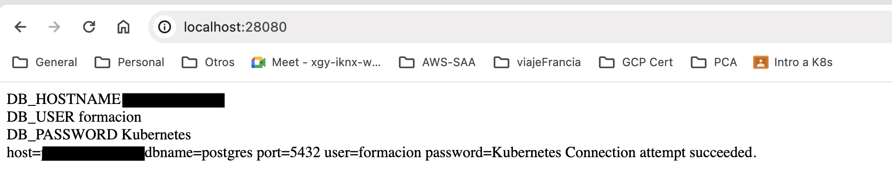
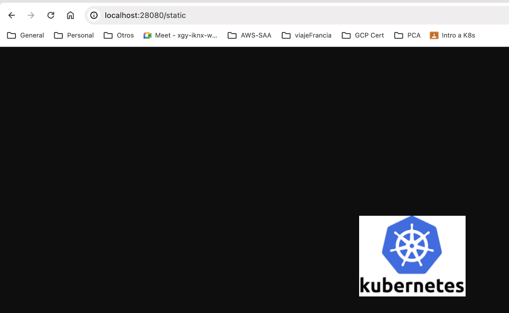

# PRÀCTICA FINAL CURS KUBERNETES

## Ejercicio 1

Desde el departamento de marketing de nuestra empresa nos han pedido hacer una web pública para nuestros clientes:
- Necesitaremos una base de datos donde almacenar la información.
- Necesitamos tener un sitio donde poder almacenar contenido estático para ser visualizado en la web (fotos principalmente).
- Necesitamos que el contenido en la medida de lo posible sea cacheado.

Tras hablarlo con el equipo de arquitectura IT se pensado en hacer una prueba de concepto. Se han definido los siguientes requisitos técnicos:

- Todos los sistemas irán sobre K8s.
- Tenemos 3 nodos de K8s los cuales 2 deberán estar tagueados como front y uno como back.

- Crearemos 3 sistemas:

    - Web: despliegue de un servidor web con 2 replicas(imagen: jlaredo/formacion-web-server-amd64 que escucha por el puerto 80). Namespace frontend. Los pods deben correr en nodos separados y en las máquinas tagueadas como front.
    Se debe conectar a la base de datos con las siguientes credenciales.    
        - DB_PASSWORD: "Kubernetes"  
    Cualquier otro dato irá en un fichero de configuracion:
        - DB_USER: "formacion"
        - DB_HOSTNAME

        - Recursos minimos: 0.1 cores y 64 MB de RAM
        - Recursos maximos: 0.2 cores y 128 MB de RAM
   
        Liveness y readiness configurado.  

    - Una base de datos postgresql (imagen: formacion-postgresql-amd64 que escucha por el puerto 5432) que estará alojada en un namespace llamado backend y debe correr en el nodo tagueado como back. Por simplicidad sólo tendrá 1 pod pero debería desplegarse como un deployment. Deberá tener un almacenamiento persistente de 1GB de disco que se monte en el pod en la ruta /var/lib/postgresql/data.
        - Recursos minimos: 0.2 cores y 128 MB de RAM
        - Recursos maximos: 0.5 cores y 256 MB de RAM

        Liveness y readiness configurado (TCP socket).

    - Servidor de contenidos con 2 replicas (imagen: jlaredo/formacion-static-server-amd64  que escucha por el puerto 80).  Namespace frontend. Los pods deben correr en nodos separados y en las máquinas tagueadas como front.

        - Recursos minimos: 0.1 cores y 64 MB de RAM

        Liveness y readiness configurado.

El sistema debe ser accesible desde fuera del cluster vía HTTP. La url que tenga un path /static debe ir al servidor de contenidos y el resto deben ir a la web.

## Ejercicio 2

- Desplegar mediante Helm un nginx (usar el chart ngnix de bitnami) por defecto. 
- Mostrar el estado de la release y los pods. 
- Cambiar la imagen que usa y poner una imagen inexistente y actualizar la release. Adjuntar ficheros generados.
- Mostrar el estado de la release y los pods.
- Hacer rollback a la versión previa.
- Mostrar el estado de la release y los pods.

## Entregable

Un zip con 2 directorios dentro, ejercicio1 y ejercicio2. Dentro de cada uno de ellos debe contenerse un fichero ejecutable y los yamls necesarios.

### Ejercicio 1:  
1. Se debe entregar un fichero de comandos (script en bash) con el nombre ejercicio1.sh que genere lo siguiente:

    - Creación del cluster de kubernetes en Kind. Debe llamarse como el apellido del alumno.
    - Creación de los diferentes objetos de forma declarativa o imperativa en el orden que se desee.

2. Ficheros necesarios (yamls) para la instalación del sistema.
3. Opcional: fichero README informando de algún comentario a tener en cuenta.

### Ejercicio 2:
1. Fichero con los comandos ejecutados (script en bash) y que muestren los cambios realizados así como los generados por el alumno.
   
### NOTAS:
Se han indicado imágenes para ser ejecutadas en máquinas con Arquitectura amd64. En caso de uso de arm, cambiar las imagenes por el sufijo arm64.  
En caso de que los ficheros de comandos no se ejecuten correctamente se podría dar por no válida la práctica.  
Se adjuntan capturas de que debe devolver el servidor de contenidos y el servidor web al acceder a la url.  

