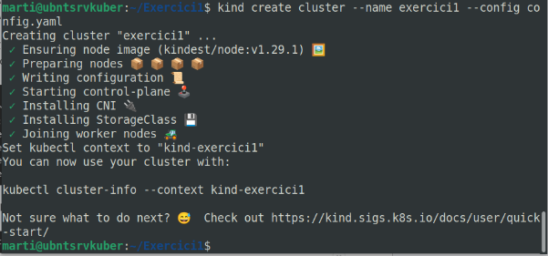

# Instal·lació de les eines necessàries a Ubuntu 22.04
Kind és una eina per executar clústers locals de Kubernetes mitjançant "nodes" de contenidors Docker. Kind es va dissenyar principalment per provar el propi Kubernetes, però es pot utilitzar per al desenvolupament local o CI.

Per instal·lar Kind a Ubuntu i provar que ens funciona Kubernetes, emprarem una màquina virtual d’Ubuntu en VirtualBox. Aquesta ha de tenir un mínim de 6GB, ara que li donarem 8 tal i com es recomana a la formació. 

Per intentar que vagi el més fluïd possible, també li donarem prou processadors, en concret, 3.

Instal·larem Ubuntu server 22.04.3 i ens connectarem per ssh per tal de fer la pràctica el més àgil possible.

Seguim la documentació que se’ns proporciona, però canviam algún punt ja que pensam que es pot millorar la instal·lació per tenir un millor ús de l’aplicació.

### Instal·lar kubectl

Si ens anem a la [pàgina de Kubernetes](https://kubernetes.io/docs/reference/kubectl/), trobam que kubectl és:

>Kubernetes provides a command line tool for communicating with a Kubernetes cluster's control plane, using the Kubernetes API. This tool is named kubectl.


Per tant, el que feim ara és instal·lar una eina que ens permetrà comunicar-mos amb el control plane del clúster de Kubernetes, emprant la seva API.

```bash
$curl -LO "https://dl.k8s.io/release/$(curl -L -s https://dl.k8s.io/release/stable.txt)/bin/linux/amd64/kubectl"
$chmod +x kubectl
$sudo mv kubectl /usr/local/bin/kubectl
```

Hem baixat el programa, l’hem fet executable i el movem a la carpeta bin

### Instal·lar docker

En aquest punt hem de fer notar que no podem instal·lar docker com un paquet snap, ja que segons la pàgina de kind,  no suporta aquesta instal·lació. Recordam que a la instal·lació d’Ubuntu server ens permet la instal·lació automàtica de docker, però és mitjançant els paquets snap. Per tant, seguim la documentació del curs.

```bash
sudo apt update
sudo apt install apt-transport-https ca-certificates curl software-properties-common
curl -fsSL https://download.docker.com/linux/ubuntu/gpg | sudo gpg --dearmor -o /usr/share/keyrings/docker-archive-keyring.gpg
echo "deb [arch=$(dpkg --print-architecture) signed-by=/usr/share/keyrings/docker-archive-keyring.gpg] https://download.docker.com/linux/ubuntu $(lsb_release -cs) stable" | sudo tee /etc/apt/sources.list.d/docker.list > /dev/null
sudo apt update
apt-cache policy docker-ce
sudo apt install docker-ce
sudo usermod -aG docker ${USER}
su - ${USER}
```
### Instal·lar go

Instal·lam go, segons la pàgina oficial i el manual del curs com a passa prèvia per instal·lar kind. Realment no es tracta d’una instal·lació sinó que ens davallam go, el posam a una carpeta d’usuari local i la posam al PATH per poder accedir als executables. Veurem llavors que no és necessari:

```bash
wget https://go.dev/dl/go1.22.0.linux-amd64.tar.gz
tar xvf go1.22.0.linux-amd64.tar.gz
export PATH=$PATH:/usr/local/bin/go
sudo mv go/ /usr/local/bin/
```
> Nota: La documentació oficial té un error. L’export PATH ha de ser /usr/local/bin/go/bin en comptes de /usr/local/go/bin


### Instal·lar kind

Seguint la documentació inicial que hi ha a la pàgina oficial hauríem de fer el següent:

```bash
go install sigs.k8s.io/kind@v0.21.0
```

Però hi ha una altra que pareix que és millor inclús i també és de la [pàgina oficial](https://kind.sigs.k8s.io/docs/user/quick-start). El que hem de fer és el següent:

```bash
[ $(uname -m) = x86_64 ] && curl -Lo ./kind https://kind.sigs.k8s.io/dl/v0.21.0/kind-linux-amd64
chmod +x ./kind
sudo mv ./kind /usr/local/bin/kind
export PATH=$PATH:/usr/local/bin/kind
```

D’aquesta forma aconseguim tenir kind com un executable en comptes d’haver-lo d’emprar amb time i go. Per això pensam que el punt 3 és innecessari i es pot tirar enrera.

## Instal·lació del màster i workers

Així ja tindrem instal·lat kind correctament a Ubuntu, amb docker i kubectl. Anem a provar que funciona, posant en marxa el màster i 3 workers.

Cream primer una carpeta anomenada Exercici1 i guardam al fitxer config.yaml la configuració per crear els nodes:

```yaml
kind: Cluster
apiVersion: kind.x-k8s.io/v1alpha4
nodes:
- role: control-plane
- role: worker
- role: worker
- role: worker
```
Llançam kind:

```bash
kind create cluster --name exercici1 --config config.yaml
```
Obtenim el següent resultat:



Si revisam quins contenidors tenim, podem observar que tenim els 3 workers i el control plane.


